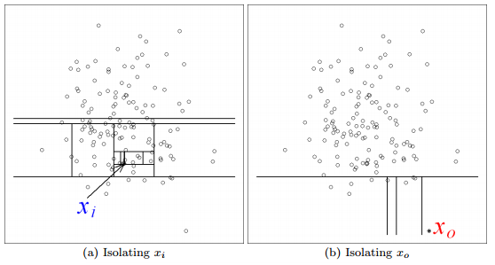

```{r, include = FALSE}
library(gapminder)
library(ggplot2)

library(xaringan)
library(xaringanExtra)
xaringanExtra::use_webcam()
knitr::opts_chunk$set(echo = FALSE)
xaringanExtra::use_panelset()

library(isotree)
library(plotly)
library(patchwork)

library(fastshap)

```

# Follow Along! 

https://github.com/skirmer/isolation_forests

---
# Introduction

Isolation forests are a method using tree-based decisionmaking to separate observations instead of grouping them. You might visualize this in tree form:


---
# Introduction

If you prefer to think about the points in two dimensional space, you can also use something like this:




Here you can see that a highly anomalous observation is easily separated from the bulk of the sample, while a non-anomalous one requires many more steps to isolate.

---
# Getting Started

Today we are going to implement this modeling approach using a sample of data from Spotify- song characteristics.

We'll be using these libraries:

* **modeling**: isotree, fastshap   
* **visuals**: ggplot2, plotly, patchwork   

---
# Load Data

Our dataset: Spotify Tracks (via Kaggle)

https://www.kaggle.com/yamaerenay/spotify-dataset-19212020-160k-tracks?select=data.csv

## Track Characteristics

```{r}
dataset = read.csv("/Users/skirmer/repos/isolation_forests/data.csv")
colnames(dataset)
```

---
# Looking at Examples

.panelset[
.panel[.panel-name[Instrumental]

```{r , echo=TRUE}
knitr::kable(head(dataset[dataset$instrumentalness > .94, c("artists", "name", "year")], 5))
```

]
.panel[.panel-name[Speechy]

```{r , echo=TRUE}
set.seed(426)
speechy = dataset[dataset$speechiness > .9 & dataset$year > 1965,
                  c("artists", "name", "year")]
knitr::kable(speechy[sample(nrow(speechy), 3), ])

```

]
.panel[.panel-name[Loud]

```{r, echo=TRUE}
set.seed(400)
loud = dataset[dataset$loudness > .85, c("artists", "name", "year")]
knitr::kable(loud[sample(nrow(loud), 3), ])

```

]]

---
# Feature Engineering

* Bin the years
* Cut off songs pre-1960


```{r, echo=FALSE}
dataset = dataset[dataset$year > 1960,]

b <- c(-Inf, 1970, 1980, 1990, 2000, 2010, Inf)
names <- c("60s", "70s", "80s", "90s", "00s", "10s to present")
dataset$year_bin <- cut(dataset$year, breaks = b, labels = names)

knitr::kable(table(dataset$year_bin))
```

```{r, echo=TRUE, include = FALSE}

features = c('acousticness', 'explicit', 'duration_ms','instrumentalness', 'key',
            'liveness', 'loudness', 'mode', 'popularity','valence',
            'speechiness', 'tempo', 'energy', 'danceability')

# Train Test Split
train_ind <- sample(nrow(dataset), size = nrow(dataset)*.7)
training_set <- dataset[train_ind, c('artists','name','year', 'year_bin', features)]
test_set <- dataset[-train_ind, c('artists','name','year', 'year_bin', features)]

```

---
# Function Syntax

We don't need to set any outcome or dependent variable because that is not the objective of this algorithm.

```{r, echo=TRUE}
iso_ext = isolation.forest(
  training_set[, features], 
  ndim=2,
  ntrees=100,
  nthreads=1,
  max_depth = 6,
  prob_pick_pooled_gain=0,
  prob_pick_avg_gain=0,
  output_score = FALSE)

Z1 <- predict(iso_ext, training_set)
Z2 <- predict(iso_ext, test_set)

training_set$scores <- Z1
test_set$scores <- Z2
```

---

# Feature Importance
```{r, echo=FALSE, warning=F, error=F, message=F, dpi = 400, fig.height=4}

shapley_values <- explain(iso_ext, X=training_set[, features], pred_wrapper = predict)
autoplot(shapley_values)+theme_bw()+labs(title="Feature Importances")
```


---
# Peeking at Results


.panelset[
.panel[.panel-name[Table of Tracks]

```{r}

knitr::kable(tail(training_set[, c('artists','name','year','scores')]))

```
]
.panel[.panel-name[Score Distribution]

```{r, echo=FALSE, fig.width=9,dpi = 400, fig.height=5, out.width=600}

ggplot(training_set, aes(x=scores))+
  theme_bw()+
  geom_density()

```

]
.panel[.panel-name[Scatterplot (Training)]


```{r, echo=FALSE, fig.width=9,dpi = 400, fig.height=5, out.width=650}
training_set$anomaly = ifelse(training_set$scores > .52, "Anomaly", "Normal")
ggplot(training_set, aes(x=tempo, y=speechiness, 
                         group = anomaly, color = anomaly))+
  theme_bw()+
  geom_point(alpha = .75)+
  labs(title="Training Sample Score")
```

]
.panel[.panel-name[Scatterplot (Test)]


```{r, echo=FALSE, fig.width=9,dpi = 400, fig.height=5, out.width=600}
test_set$anomaly = ifelse(test_set$scores > .52, "Anomaly", "Normal")
ggplot(test_set, aes(x=tempo, y=speechiness, 
                     group = anomaly, color = anomaly))+
  theme_bw()+
  geom_point(alpha = .75)+
  labs(title="Test Sample Score")
```
]]

---
# PCA


.panelset[
.panel[.panel-name[Component Choices]

```{r, echo=FALSE, fig.width=9,dpi = 400, fig.height=5, out.width=650}
trainingpca <- prcomp(training_set[, features], scale. = T)

std_dev <- trainingpca$sdev
pr_var <- std_dev^2
prop_varex <- pr_var/sum(pr_var)

plot(prop_varex, xlab = "Principal Component",
             ylab = "Proportion of Variance Explained",
             type = "b")

trainingpca = data.frame(training_set[, c("artists", "name", "year", "scores", "anomaly")], trainingpca$x)

```

]
.panel[.panel-name[3D Rendering]


```{r, echo=FALSE}
tpca = trainingpca[, c(1:8)]

m <- list(
  l = 20,
  r = 20,
  b = 0,
  t = 0,
  pad = 20
)
```

```{r, echo=FALSE, dpi = 400, out.height = 300, out.width=650, warning=F, error=F, message=F}

tpca$anomaly <- as.factor(tpca$anomaly)

fig <- plot_ly(tpca, x = ~PC2, y = ~PC3, z = ~PC1, color = ~anomaly, colors = c('#BF382A', '#0C4B8E'), width = 600, height = 350)
fig <- fig %>% add_markers(size= 2)
fig <- fig %>% layout(scene = list(xaxis = list(title = 'PC2'),
                     yaxis = list(title = 'PC3'),
                     zaxis = list(title = 'PC1')))

fig %>% layout(autosize = F, margin = m)
```
]]

---
# Other Exploration


.panelset[
.panel[.panel-name[Decade Proportions]

```{r, fig.width=9,dpi = 400, fig.height=5, out.width=700}
ggplot(training_set, aes(x=as.factor(year_bin),fill = as.factor(anomaly)))+
  theme_bw()+
  geom_bar()+
  labs(title="Anomalousness by Decade", x="Decade", y="Records")
```

]
.panel[.panel-name[Score Density]

```{r, fig.width=9,dpi = 400, fig.height=5, out.width=700}
ggplot(training_set, aes(x=scores, y=as.factor(anomaly))) + theme_bw() + geom_bin2d() + labs(title = 'Density of Scores', x="Scores", y="Anomaly Status")
```
]]

---
# Further Links/Reference

https://ggplot2.tidyverse.org/  
https://plotly.com/r/3d-scatter-plots/   
https://github.com/david-cortes/isotree   

---
# Thank you!

[www.stephaniekirmer.com](http://www.stephaniekirmer.com) | @[data_stephanie](http://www.twitter.com/data_stephanie) |  [saturncloud.io](http://saturncloud.io)  
